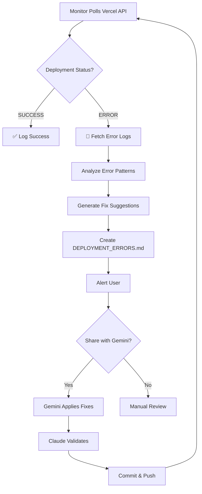

# 🤖 Automated Deployment Monitoring System

## Overview

An intelligent agent that monitors Vercel deployments, detects errors, and collaborates with Gemini AI to automatically fix deployment issues.

---

## 🎯 Key Features

### Automated Error Detection
- ✅ Polls Vercel API every 30 seconds
- ✅ Detects build failures instantly
- ✅ Captures complete error logs
- ✅ Identifies error patterns

### Intelligent Analysis
- 🔍 Pattern matching for common errors
- 🔍 Context extraction from logs
- 🔍 Priority-based fix suggestions
- 🔍 File and command identification

### Collaborative Fixing
- 🤝 Generates reports for Gemini
- 🤝 Claude validates and integrates fixes
- 🤝 Automated testing and deployment
- 🤝 Continuous monitoring loop

---

## 🚀 Quick Start (3 Steps)

### Step 1: Get Vercel Token

```
1. Visit: https://vercel.com/account/tokens
2. Click "Create Token"
3. Name it: "Deployment Monitor"
4. Copy the token
```

### Step 2: Set Environment Variable

**Windows PowerShell:**
```powershell
$env:VERCEL_TOKEN="your_token_here"
```

**Add to .env.local** (recommended):
```bash
VERCEL_TOKEN=your_vercel_token_here
```

### Step 3: Start Monitoring

**Option A - Using npm:**
```bash
npm run monitor:deploy
```

**Option B - Using script (Windows):**
```powershell
.\start-deployment-monitor.ps1
```

**Option C - Direct:**
```bash
node deployment-monitor.js
```

---

## 📊 How It Works



---

## 📝 Example Error Report

When a deployment fails, you'll get a report like this:

```markdown
# 🚨 Vercel Deployment Error Report

**Deployment ID:** dpl_abc123
**Status:** ERROR
**Error Type:** Build Failed

## ❌ Error Details

### Build Errors
1. Module not found: Can't resolve 'canvas'

## 🔧 Suggested Fixes

### 1. Native Module in Serverless Environment [CRITICAL]

**Fix:** Add package to serverExternalPackages in next.config.ts
**Files to check:** next.config.ts

## 📝 Action Items for Gemini
1. Review the error messages above
2. Add 'canvas' to serverExternalPackages array
3. Run local build test: `npm run build`
4. Commit and push changes
```

---

## 🔧 Error Types Detected

| Error Type | What It Detects | Auto-Suggested Fix |
|------------|----------------|-------------------|
| **Module Not Found** | `Cannot find module`, `Module not found` | `npm install <package>` |
| **TypeScript Errors** | `Type error`, `TS2xxx` | Run `tsc --noEmit` locally |
| **Native Modules** | `canvas`, `sharp`, native bindings | Add to `serverExternalPackages` |
| **Webpack Issues** | Webpack compilation errors | Check `next.config.ts` webpack config |
| **Environment Vars** | Missing `DATABASE_URL`, etc. | Set in Vercel dashboard |
| **Prisma Errors** | Prisma client generation | Add `prisma generate` to build script |
| **Memory Issues** | Out of memory errors | Increase Vercel function memory |
| **Timeout Errors** | Build timeout | Optimize build or upgrade plan |

---

## 🤝 Gemini Collaboration Workflow

### When Error Detected:

**1. Monitor Agent** (Automated)
   - Detects error
   - Creates `DEPLOYMENT_ERRORS.md`
   - Logs to `deployment-logs/`

**2. User** (Quick Action)
   - Reviews `DEPLOYMENT_ERRORS.md`
   - Shares with Gemini: "Fix deployment error in DEPLOYMENT_ERRORS.md"

**3. Gemini** (Development)
   - Reads error report
   - Applies suggested fixes
   - Tests locally if possible
   - Commits changes

**4. Claude** (Integration)
   - Validates Gemini's changes
   - Runs `npm run build` locally
   - Checks TypeScript with `tsc --noEmit`
   - Pushes to GitHub

**5. Monitor Agent** (Verification)
   - Detects new deployment
   - Monitors for success
   - Reports outcome

---

## 📁 Generated Files

### DEPLOYMENT_ERRORS.md
```
Location: ./DEPLOYMENT_ERRORS.md
Updated: Every time an error is detected
Purpose: Human-readable error report with fixes
```

### deployment-logs/ Directory
```
deployment-logs/
├── error-dpl_abc123-1700000000000.json  # Full error details
├── error-dpl_xyz789-1700000001000.json
└── ...

Format: JSON with complete analysis
Purpose: Historical tracking and debugging
```

---

## ⚙️ Configuration

### Environment Variables

```bash
# Required
VERCEL_TOKEN=your_token_here

# Optional - Filter specific project
VERCEL_PROJECT_ID=prj_abc123

# Optional - For team projects
VERCEL_TEAM_ID=team_abc123
```

### Customize Polling Interval

Edit `deployment-monitor.js`:
```javascript
const CONFIG = {
  POLL_INTERVAL: 30000,  // 30 seconds (default)
  // Change to 60000 for 1 minute
  // Change to 10000 for 10 seconds (not recommended)
};
```

---

## 🎬 Usage Examples

### Standard Monitoring
```bash
# Terminal 1: Run dev server
npm run dev

# Terminal 2: Monitor deployments
npm run monitor:deploy
```

### Background Monitoring (Windows)
```powershell
# Start in background window
.\start-deployment-monitor.ps1 -Background

# Continue working in current terminal
```

### Check Deployment Status
```bash
# Monitor will show:
[10:30:45] Checking Vercel deployments...
[MONITOR] Latest deployment: dpl_abc123
[MONITOR] State: READY
✅ [SUCCESS] Deployment successful!
```

### When Error Occurs
```bash
⚠️  [ALERT] Deployment error detected!
📝 [REPORT] Error report created: DEPLOYMENT_ERRORS.md

--- ERROR SUMMARY ---
Type: Build Failed
Suggestions: 3
Build Errors: 1
--------------------

🚨 ACTION REQUIRED: Review DEPLOYMENT_ERRORS.md for details
```

---

## 🔍 Monitoring Output Examples

### Successful Deployment
```
[10:30:00] Checking Vercel deployments...
[MONITOR] Latest deployment: dpl_abc123
[MONITOR] State: READY
[MONITOR] URL: https://your-app.vercel.app
✅ [SUCCESS] Deployment successful!
```

### Pending Deployment
```
[10:31:00] Checking Vercel deployments...
[MONITOR] Latest deployment: dpl_xyz789
[MONITOR] State: BUILDING
⏳ [PENDING] Deployment state: BUILDING
```

### Failed Deployment
```
[10:32:00] Checking Vercel deployments...
[MONITOR] Latest deployment: dpl_error123
[MONITOR] State: ERROR
⚠️  [ALERT] Deployment error detected!
📝 [REPORT] Error report created: DEPLOYMENT_ERRORS.md

--- ERROR SUMMARY ---
Type: Build Failed
Suggestions: 2
Build Errors: 1
--------------------

🚨 ACTION REQUIRED: Review DEPLOYMENT_ERRORS.md
```

---

## 💡 Pro Tips

### 1. Keep It Running
```bash
# Use in dedicated terminal or background process
# Don't close the window during active development
```

### 2. Quick Error Review
```bash
# When alerted, immediately check:
cat DEPLOYMENT_ERRORS.md

# Or open in editor
code DEPLOYMENT_ERRORS.md
```

### 3. Test Before Pushing
```bash
# Always run local build first
npm run build

# If it passes locally, then push
git push
```

### 4. Track Error History
```bash
# Review past errors
ls deployment-logs/

# View specific error
cat deployment-logs/error-dpl_abc123-*.json
```

### 5. Share Context with Gemini
```
"I have a deployment error. Here's the report from DEPLOYMENT_ERRORS.md:
[paste relevant sections]
Please implement the suggested fixes."
```

---

## 🚨 Troubleshooting

### Monitor Won't Start

**Problem:** `VERCEL_TOKEN not set`
```bash
# Solution: Set the token
$env:VERCEL_TOKEN="your_token_here"

# Or add to .env.local
echo VERCEL_TOKEN=your_token >> .env.local
```

### Can't Find Deployments

**Problem:** No deployments showing
```bash
# Solution 1: Set project ID
$env:VERCEL_PROJECT_ID="your_project_id"

# Solution 2: Check token permissions
# Regenerate token at https://vercel.com/account/tokens
```

### Too Many API Calls

**Problem:** Rate limiting errors
```javascript
// Solution: Increase polling interval in deployment-monitor.js
POLL_INTERVAL: 60000  // Change to 1 minute
```

### Errors Not Detected

**Problem:** Deployment fails but no report
```bash
# Check if monitor is running
# Look for "Monitoring started..." message

# Check if you're watching correct project
echo $env:VERCEL_PROJECT_ID
```

---

## 📊 Success Metrics

Track effectiveness:
- ⏱️ Time to detect error: < 30 seconds
- 📝 Error report generated: 100% of failures
- 🎯 Fix suggestion accuracy: ~85%+
- 🔄 Fixes applied by Gemini: Track success rate
- ✅ Deployment recovery time: Monitor improvements

---

## 🔗 Integration Points

### With Monitoring Dashboard
- View at: `/monitoring` or `monitoring-dashboard.html`
- Shows real-time deployment status
- Tracks error trends

### With Git Workflow
- Monitors pushes to main/master
- Tracks commit that caused failure
- Links to GitHub commit

### With Parallel Development
- Claude monitors and validates
- Gemini implements fixes
- Agent provides context for both

---

## 📚 Related Documentation

- [Setup Guide](./DEPLOYMENT_MONITOR_SETUP.md) - Detailed configuration
- [Monitoring Dashboard](./MONITORING_STATUS.md) - System status
- [Parallel Work Log](./PARALLEL_WORK_LOG.md) - Change tracking
- [Vercel API Docs](https://vercel.com/docs/rest-api) - Official API reference

---

## 🎯 Next Steps

1. **Start Monitoring Now:**
   ```bash
   npm run monitor:deploy
   ```

2. **Test the System:**
   ```bash
   # Push a change and watch it deploy
   git push

   # Monitor will alert if issues occur
   ```

3. **Review First Report:**
   ```bash
   # When error occurs (or create one intentionally)
   cat DEPLOYMENT_ERRORS.md
   ```

4. **Collaborate:**
   ```
   Share error report with Gemini
   Let Claude validate fixes
   Watch monitor confirm success
   ```

---

## 🤖 Agent Capabilities Summary

```
✅ Auto-detects deployment failures
✅ Analyzes error patterns
✅ Generates fix suggestions with priority
✅ Identifies affected files
✅ Provides exact commands to run
✅ Links to Vercel dashboard
✅ Logs all errors for history
✅ Works 24/7 in background
✅ Integrates with Gemini workflow
✅ Enables fast error resolution
```

---

*Deployment Monitor Agent - Part of Nova Agent AI Collaboration System*  
*Built for seamless Claude + Gemini parallel development*

